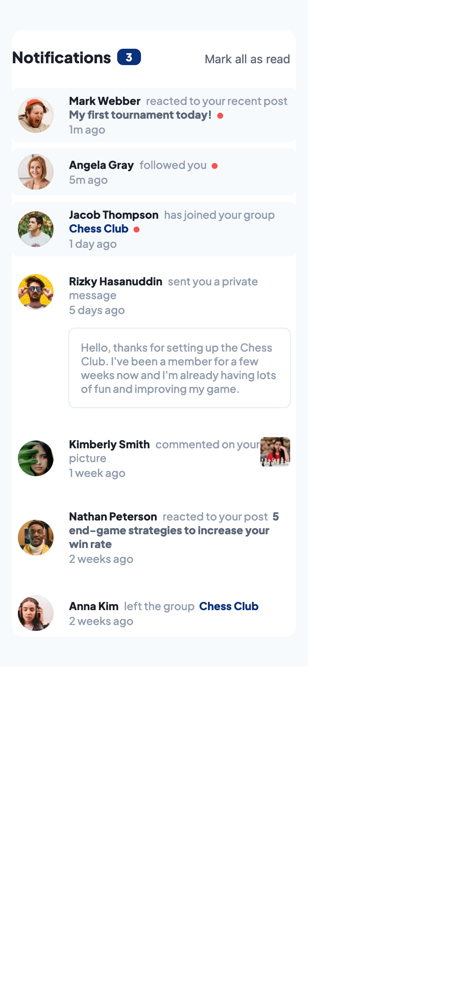

### Links

- Solution URL: [Add solution URL here](https://your-solution-url.com)
- Live Site URL: [Add live site URL here](https://your-live-site-url.com)

# Frontend Mentor - Notifications page solution

This is a solution to the [Notifications page challenge on Frontend Mentor](https://www.frontendmentor.io/challenges/notifications-page-DqK5QAmKbC/hub).

## Table of contents

- [Links](#links)
- [Screenshot](#screenshot)
- [Feautures](#features)
- [Built with](#built-with)
- [Author](#author)

### Screenshots

### Features

    1.Mark All as Read Button: Users can click the "Mark all as read" button to mark all unread notifications as read. The notification count is updated accordingly.

    2.Interactive Notifications: Users can click on individual notifications to mark them as read. The notification count is updated dynamically.

    3.Responsive Design: The page is designed to be responsive, providing a seamless experience on screens of various sizes.

### Built with

- HTML: Structured the content of the web page.
- CSS: Styled the components and implemented responsive design.
- JavaScript: Added interactivity to the notifications, allowing users to mark them as read.

## Author

- Website - [Add your name here](https://www.your-site.com)
- Frontend Mentor - [@User9511](https://www.frontendmentor.io/profile/User9511)
